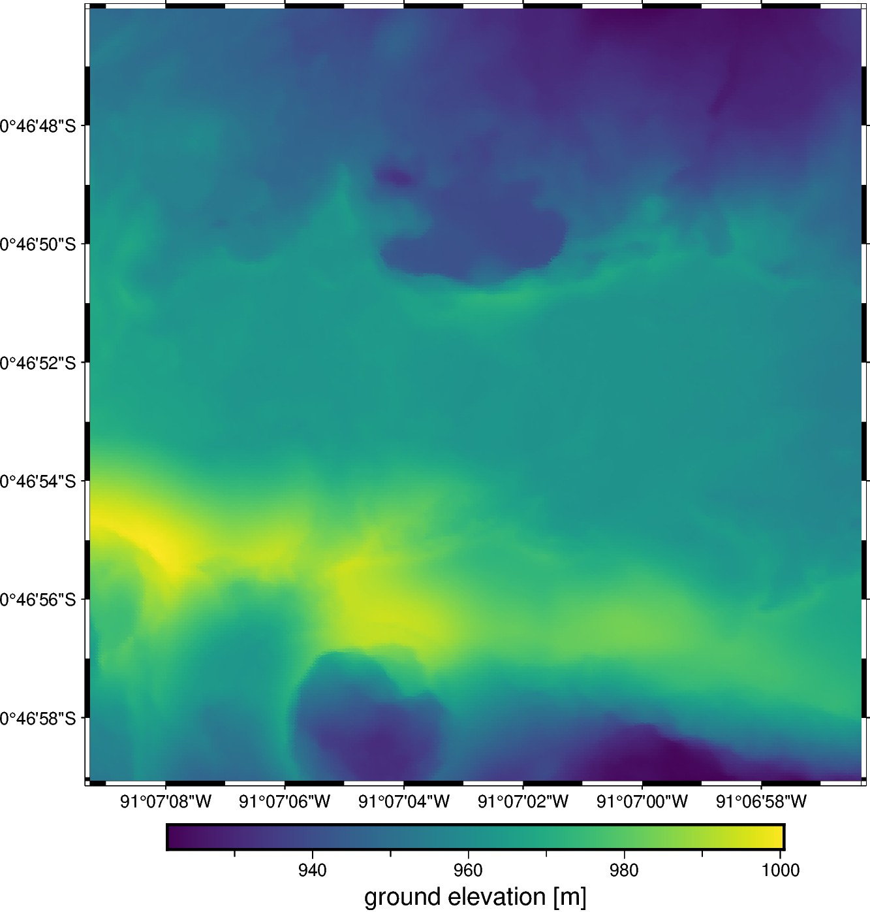

# Sierra Negra volcano, Ecuador - Topography

This is a topography point cloud of the 2018 lava flows of the Sierra Negra
volcano, located on the Galápagos islands, Ecuador.
The data are generated using structure from motion (SFM) and shows nice
topographic features and different roughness of the lava flows.
Good to show examples of calculating slope and other terrain properties from
the point cloud or gridded data.

| | Summary |
|--:|:--|
| File | `sierra-negra-topography.csv` |
| Size | 8.5 Mb |
| Version | [v1](https://github.com/fatiando-data/sierra-negra-topography/releases/latest) |
| DOI | https://doi.org/10.5281/zenodo.6139057 |
| License | [CC-BY](https://creativecommons.org/licenses/by/4.0/) |
| MD5 | `md5:9f6f64d47d26773e37b154cf964724e3` |
| SHA256 | `sha256:1c2981dc38af5dbee1e4f73616049c37202e508a91563ca8176b728c3cc6882a` |
| Source | [Carr, B. (2020). Sierra Negra Volcano (TIR Flight 3): Galápagos, Ecuador, October 22 2018. Distributed by OpenTopography.](https://doi.org/10.5069/G957196P) |
| Original license | [CC-BY](https://doi.org/10.5069/G957196P) |
| Processing code | [`prepare.ipynb`](https://nbviewer.org/github/fatiando-data/sierra-negra-topography/blob/main/prepare.ipynb) |

## Changes made

> These are the changes made to the original dataset.

* Data were cropped to smaller region to align with previously published
  studies of the data and make file sizes under 10 Mb.
* Coordinates converted from UTM to WGS84 geographic.
* Export to a compressed CSV for easier loading with Pandas.

## Useful references

Prior use of this dataset:

* [Carr et al. (2021)](https://doi.org/10.1016/j.rse.2021.112581)

## About this repository

This is a place to format and prepare the original dataset for use in our
tutorials and documentation.

We include the source code that prepares the datasets for redistribution by
filtering, standardizing, converting coordinates, compressing, etc.
The goal is to make loading the data as easy as possible (e.g., a single call
to `pandas.read_csv` or `xarray.load_dataset`).
Whenever possible, the code also downloads the original data (otherwise the
original data are included in this repository).

> 💡 **Tip:** The easiest way to download this dataset is using
> [Pooch](https://www.fatiando.org/pooch), particularly to download straight
> from the DOI of a release.

## Contributing

See our [Contributing Guidelines][contrib] for information on proposing new
datasets and making changes to this repository.

## License

All Python source code is made available under the BSD 3-clause license. You
can freely use and modify the code, without warranty, so long as you provide
attribution to the authors.

Unless otherwise specified, all data files and figures created by the code are
available under the Creative Commons Attribution 4.0 License (CC-BY).

See [`LICENSE.txt`](LICENSE.txt) for the full text of each license.

The license for the original data is specified in this `README.md` file.

[contrib]: https://github.com/fatiando-data/.github/blob/main/CONTRIBUTING.md
